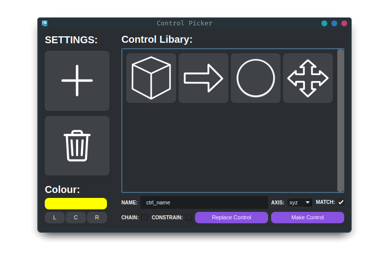

<h1 align="center">Maya-Control-Picker aka MCP</h1>
<p align="center">
    
    
    
</p>
<div align="center">
    
</div>

### Running The Tool

> [!WARNING]
> - This tool was developed as a summer project and will likely not be production ready.
> - Tool is designed to be ran through maya.

```python
from importlib import reload
import maya_control_picker
reload(maya_control_picker)

maya_control_picker.start_interface()
```

